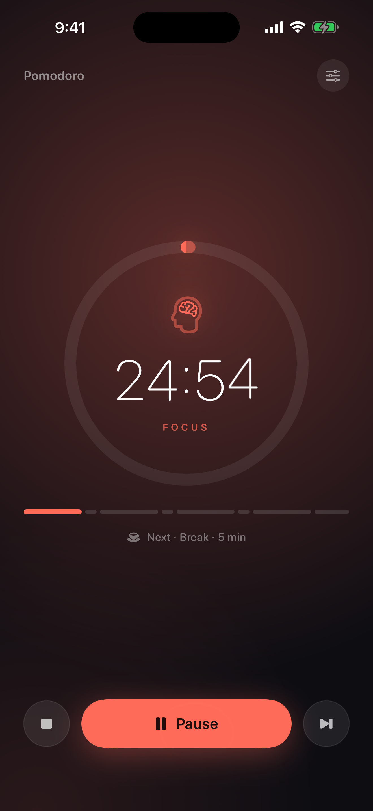
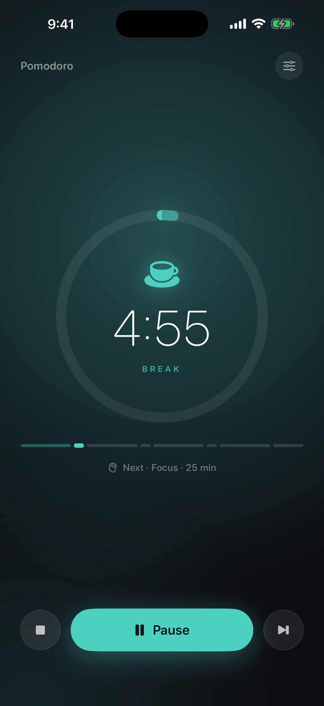
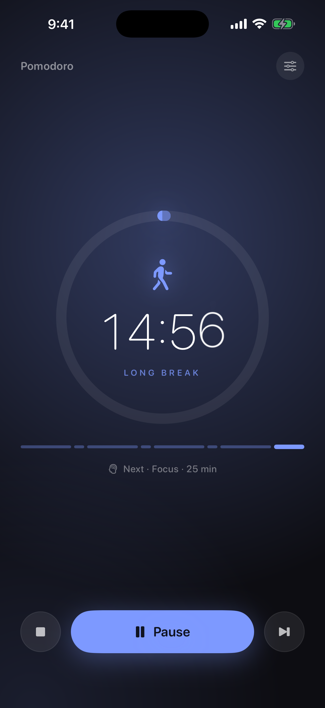
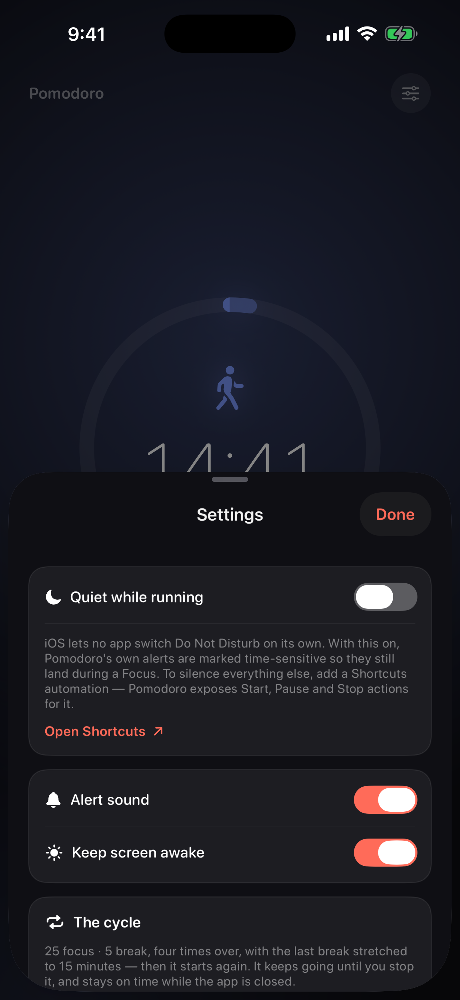

# Pomodoro

A small, deliberately quiet Pomodoro timer for iPhone. One screen, one gesture, no accounts, no analytics, no settings you have to tune before it's useful.

It runs a continuous cycle — **25 focus · 5 break, four times over, with the last break stretched to 15 minutes** — and then starts again. It keeps going until you stop it.

<p align="center">
  
  
  
  
</p>

---

## Why another timer

Most Pomodoro apps drift when you lock your phone, or make you press "start" eight times an hour. This one does neither:

- **The clock is derived, not counted.** The current phase and its remaining time are computed from a single absolute anchor date. Backgrounding, locking, force-quitting, or a clock change can't desynchronize it — there is no tick to miss.
- **The whole cycle announces itself.** Every upcoming phase change is scheduled as a local notification when you press start, so alerts land on time with the app closed.
- **It shows up where you're already looking.** A Live Activity puts the countdown on the Lock Screen, in the Dynamic Island, and full-screen in StandBy when the phone is charging in landscape.

## Features

| | |
|---|---|
| **Continuous cycle** | 25-5-25-5-25-5-25-15, repeating. Never needs restarting mid-session. |
| **Full manual control** | Pause, resume, skip a phase, or stop back to the top of the cycle at any moment. Tapping the dial toggles pause. |
| **Cycle track** | All eight segments drawn to scale, so you can see where you are in the 130-minute cycle at a glance. |
| **Phase identity** | Focus, break, and long break each get their own accent colour and glyph — the whole screen shifts with the phase. |
| **Live Activity** | Lock Screen, Dynamic Island, and StandBy, with a system-driven countdown and progress ring. |
| **Shortcuts / Siri** | `Start Pomodoro`, `Pause Pomodoro`, `Stop Pomodoro` App Intents. |
| **Quiet mode** | Marks Pomodoro's own alerts time-sensitive so they survive a Focus, and points you at the Shortcuts automation that flips Do Not Disturb. |
| **Survives relaunch** | Session state is persisted; reopening a killed app resumes exactly where the clock actually is. |

## Requirements

- iOS 17.0 or later
- Xcode 16 or later to build
- [XcodeGen](https://github.com/yonaskolb/XcodeGen) (`brew install xcodegen`) — the `.xcodeproj` is generated, not committed

## Building

```bash
xcodegen generate
```

Then open `Pomodoro.xcodeproj`, or build from the command line:

```bash
xcodebuild -project Pomodoro.xcodeproj -scheme Pomodoro -sdk iphonesimulator -destination 'generic/platform=iOS Simulator' build
```

To install on a device, set `DEVELOPMENT_TEAM` in `project.yml` to your own team ID, then:

```bash
xcodebuild -project Pomodoro.xcodeproj -scheme Pomodoro -configuration Debug -destination 'id=<your-device-udid>' -allowProvisioningUpdates -allowProvisioningDeviceRegistration build
```

`xcrun devicectl list devices` will give you the device identifier. The phone needs Developer Mode enabled (Settings → Privacy & Security → Developer Mode).

## Project layout

```
Pomodoro/            App target — timer engine, UI, settings, Live Activity driver
PomodoroShared/      Code shared by app and widget: Phase, Cycle, activity attributes
PomodoroWidgets/     Widget extension — Live Activity views for Lock Screen, Island, StandBy
project.yml          XcodeGen project definition
```

### How the timer works

`Cycle` owns the pattern and is the only definition of it — the app, the cycle track, and the widget all read from it, so they cannot drift apart.

`PomodoroTimer` holds a single piece of state that matters: `anchor`, the absolute date the session's elapsed time is measured from. Everything visible — phase, remaining seconds, ring progress, position in the cycle — is a pure function of `Cycle.position(at: Date().timeIntervalSince(anchor))`. Pausing stores the elapsed time and drops the anchor; resuming re-derives it. The 0.1 s ticker exists only to refresh the view.

The Live Activity carries the anchor rather than a snapshot, so the widget re-derives the live phase itself at render time instead of trusting state the app may have been asleep to update.

## Known limitations

**iOS gives no app an API to turn on Do Not Disturb.** Apple exposes Focus modes only to Shortcuts. Quiet mode does the two things that are possible: it marks Pomodoro's alerts time-sensitive so they arrive during a Focus, and it exposes Start/Pause/Stop intents so you can build the automation yourself:

> Shortcuts → Automation → *When Pomodoro is opened* → **Turn On Do Not Disturb**

**A suspended app cannot update its own Live Activity.** The countdown and ring are system-driven and always exact, and the widget re-derives the phase from the anchor whenever the system re-renders it. Guaranteeing an instantaneous phase-label flip at a boundary while the app is suspended requires ActivityKit push updates, which need an APNs key and a server.

## License

Apache License 2.0 — see [LICENSE](LICENSE).
