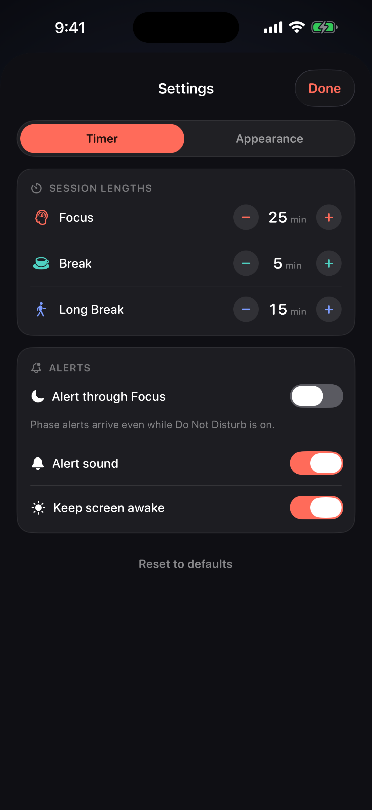
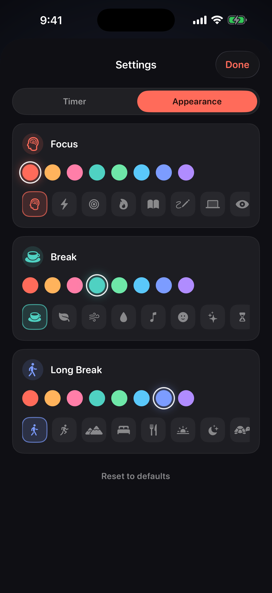

# Cadence

A quiet, single-screen focus timer for iPhone. No account, no analytics, no upsell — open it, press start, and it runs the whole working session for you.

Cadence cycles **focus · break, four times over, with the last break longer** — 25 / 5 / 15 by default — and repeats until you stop it. Every length, colour, and glyph is yours to change.

<p align="center">
  
  
  
  
  
</p>

---

## Why this one

Most timers lose the thread the moment you lock your phone, or make you press start eight times an hour. This one does neither.

- **The clock is derived, not counted.** Phase and remaining time are computed from a single absolute anchor date. Backgrounding, locking, force-quitting, or a clock change can't desynchronise it — there is no tick to miss.
- **The cycle announces itself.** Every upcoming phase change is scheduled the moment you press start, so alerts land on time with the app closed. Turn on *Alert through Focus* and they arrive even during Do Not Disturb.
- **It shows up where you're already looking.** A Live Activity puts the countdown on the Lock Screen, in the Dynamic Island, and full-screen in StandBy when the phone is charging on its side.

## Features

| | |
|---|---|
| **Continuous cycle** | Runs focus → break → focus → … → long break, then starts over. Never needs restarting mid-session. |
| **Full control** | Pause, resume, restart just the current phase, skip ahead, or stop back to the top of the cycle. Tapping the dial pauses too. |
| **Your lengths** | Focus 5–90 min, break 1–30, long break 5–60. |
| **Your colours** | Eight accents per phase; the whole screen — ring, glow, buttons, Live Activity — follows the one you pick. |
| **Your glyphs** | A curated symbol set per phase, tinted to match. |
| **Cycle track** | All eight segments drawn to scale, so you can see where you are at a glance. |
| **Live Activity** | Lock Screen, Dynamic Island, and StandBy, with a system-driven countdown and progress ring. |
| **Siri, Shortcuts, Action Button** | *Start*, *Pause*, *Stop*, and *Start or Pause* actions — assign one to the Action Button for one-press focus. |
| **Landscape** | A dedicated side-by-side layout, not a stretched portrait one. |
| **Survives everything** | Session state is persisted; reopening a killed app resumes exactly where the clock really is. |

Nothing leaves your phone. There is no network code in the app at all — see [PRIVACY.md](PRIVACY.md).

## Requirements

- iPhone running iOS 17.0 or later
- Xcode 16+ and [XcodeGen](https://github.com/yonaskolb/XcodeGen) (`brew install xcodegen`) to build — the `.xcodeproj` is generated, not committed

## Building

```bash
xcodegen generate
```

Then open `Pomodoro.xcodeproj`, or build from the command line:

```bash
xcodebuild -project Pomodoro.xcodeproj -scheme Pomodoro -sdk iphonesimulator -destination 'generic/platform=iOS Simulator' build
```

To install on your own device, set `DEVELOPMENT_TEAM` in `project.yml` to your team ID, enable Developer Mode on the phone (Settings → Privacy & Security → Developer Mode), then:

```bash
xcodebuild -project Pomodoro.xcodeproj -scheme Pomodoro -configuration Debug -destination 'id=<device-udid>' -allowProvisioningUpdates -allowProvisioningDeviceRegistration build
```

`xcrun devicectl list devices` prints the identifier; `xcrun devicectl device install app --device <udid> <path-to-.app>` installs the result.

## Project layout

```
Pomodoro/            App target — timer engine, UI, settings, Live Activity driver
PomodoroShared/      Shared with the widget: Phase, Cycle, Config, activity attributes
PomodoroWidgets/     Widget extension — Live Activity views for Lock Screen, Island, StandBy
project.yml          XcodeGen project definition
```

### How it works

`Cycle` owns the pattern and is its only definition — the app, the cycle track, and the widget all read from it, so they cannot drift apart. Phase lengths come from the user's `Timings`, so the same code serves any configuration.

`PomodoroTimer` keeps one piece of state that matters: `anchor`, the absolute date the session's elapsed time is measured from. Everything visible — phase, remaining seconds, ring progress, position in the cycle — is a pure function of `Cycle.position(at: Date().timeIntervalSince(anchor), timings:)`. Pausing stores the elapsed time and drops the anchor; resuming re-derives it. The 0.1 s ticker exists only to refresh the view.

The Live Activity carries the anchor and the user's config rather than a rendered snapshot, so the widget re-derives the live phase itself and renders in the user's own colours and glyphs.

## Known limitation

**A suspended app cannot update its own Live Activity.** The countdown and ring are system-driven and always exact, and the widget re-derives the phase from the anchor whenever the system re-renders it. Guaranteeing an instantaneous phase-label flip at a boundary while the app is suspended would require ActivityKit push updates, which need an APNs key and a server — deliberately out of scope for an app with no backend.

## License

Apache License 2.0 — see [LICENSE](LICENSE).
